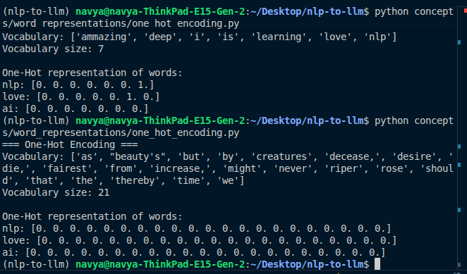

for learing i have write a simpe normalization code but we also have this packsage name `clean-text`:

Here is the usage code:

```
from cleantext import clean

def normalize_text(text):
    return clean(text,
                 lower=True,
                 no_urls=True,
                 no_emails=False,
                 no_phone_numbers=False,
                 no_numbers=True,
                 no_digits=True,
                 no_currency_symbols=False,
                 no_punct=True,
                 replace_with_punct="",
                 lang="en")   

```


## Stop Word Removal

The frequerently ocuring words that are semantically not important like (the ,is ,a)


## Stemming and Lemitization:

BOth are the part of the nlp text preprocessing and both haver its own role.


stemming is fast while lemitization is slower as it need POS  taging.

stemming has no context awareness while lemitization has context awareness due to past of speech and sentence contexxt.

we use lemmatization if we need high accurac yand stemming for speed for critical situation like search engen , large scale text indexing.


perfer stemmingin large corpus and for smalll to medium use the lemmatization .


Word Representations

### ONe-Hot endoding:

issues as the vocabularies grows the vector becoomes huge curseof dimensionality

also cant express the semmentic meaning or relationship between words:

Example:


tesying it is good 